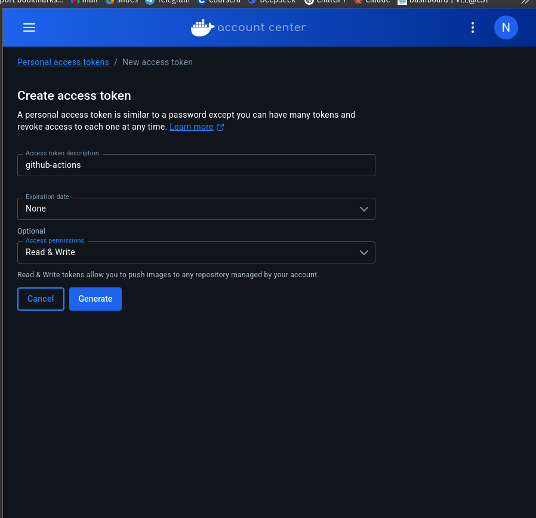
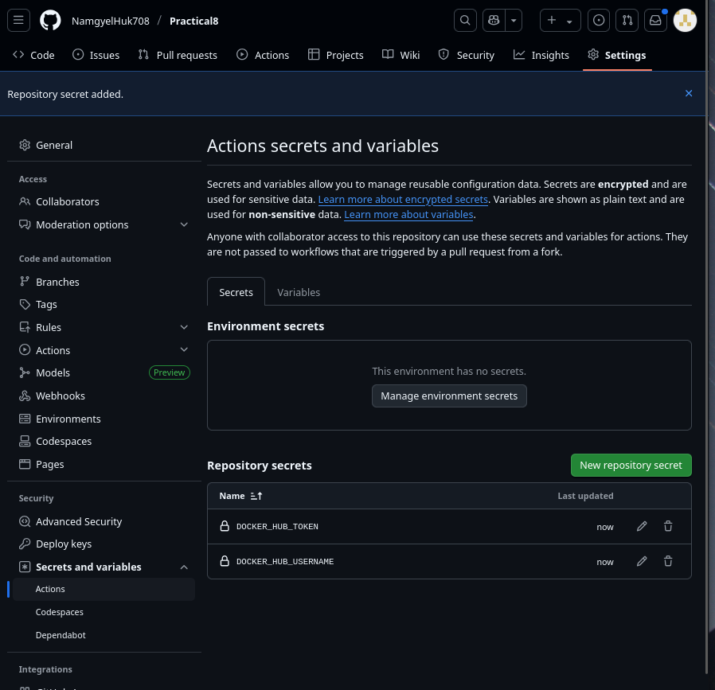
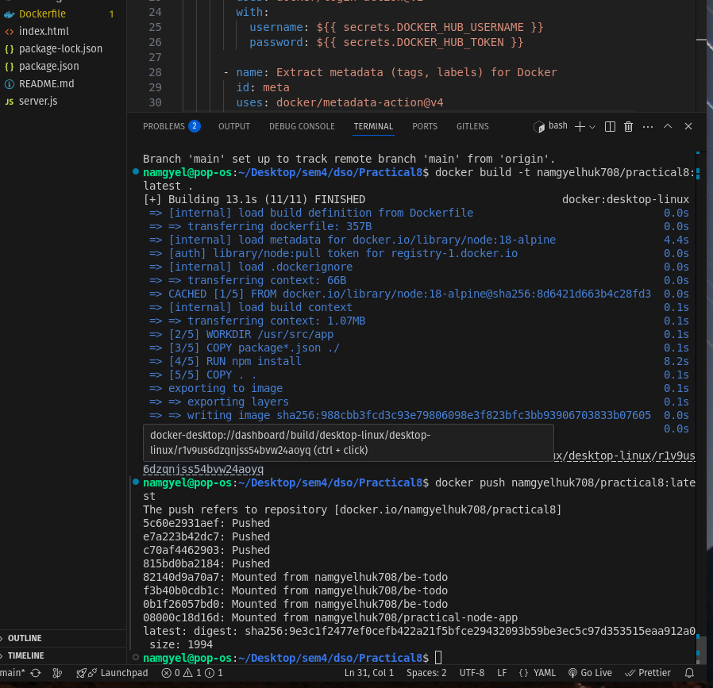
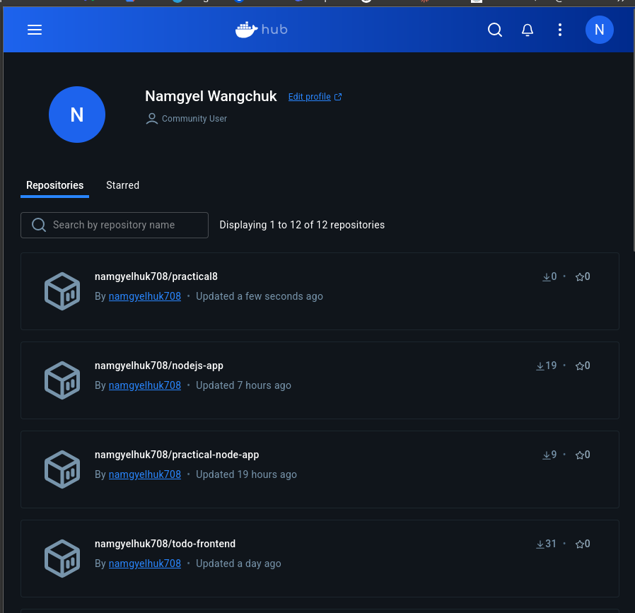
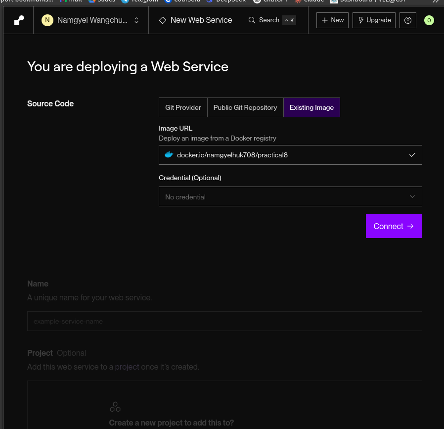
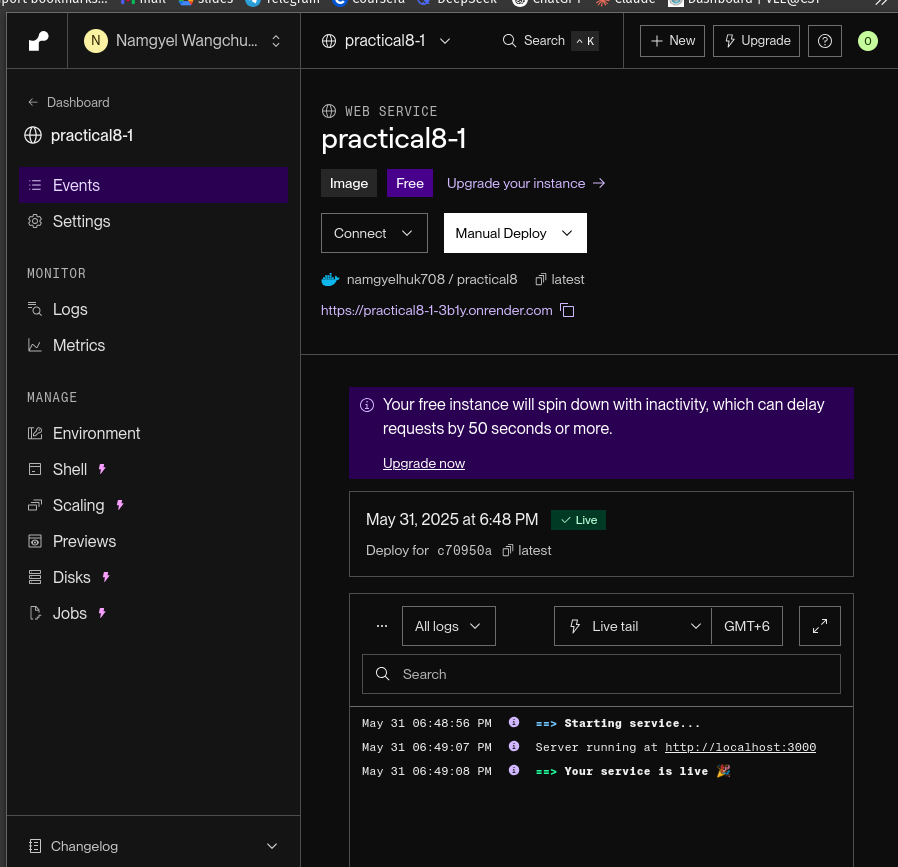
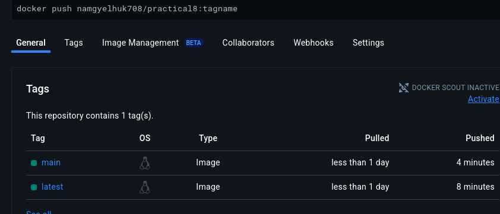
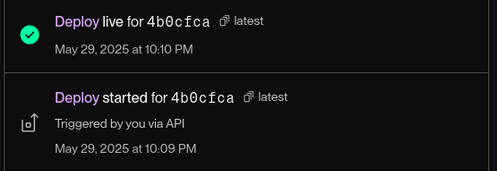

# Node.js CI/CD Pipeline with GitHub Actions, Docker Hub, and Render

This walkthrough demonstrates a complete CI/CD workflow for a simple Node.js web application using GitHub Actions, Docker Hub, and Render.com.

## Project Setup

### Step 1: Set Up a Simple Node.js Project

1. **Create project directory and initialize Node.js:**

2. **Install Express:**
   ```bash
   npm install express
   ```

3. **Create `server.js`:**
   ```javascript
   const express = require('express');
   const app = express();
   const PORT = 3000;

   app.use(express.static('public'));

   app.get('/', (req, res) => {
     res.sendFile(__dirname + '/public/index.html');
   });

   app.listen(PORT, () => {
     console.log(`Server running on port ${PORT}`);
   });
   ```

4. **Create `public/index.html`:**
   ```html
   <!DOCTYPE html>
   <html>
   <head>
     <title>CI/CD Demo</title>
   </head>
   <body>
     <h1>Hello from CI/CD Pipeline!</h1>
     <p>This app is deployed automatically.</p>
   </body>
   </html>
   ```

### Step 2: Dockerize the Application

1. **Create `Dockerfile`:**
   ```dockerfile
   FROM node:18-alpine
   WORKDIR /usr/src/app
   COPY package*.json ./
   RUN npm install
   COPY . .
   EXPOSE 3000
   CMD ["node", "server.js"]
   ```

2. **Add `.dockerignore`:**
   ```
   node_modules
   npm-debug.log
   ```

### Step 3: Initialize Git and Push to GitHub

1. **Initialize Git repository:**

2. **Connect to GitHub:**
 
### Step 4: Set Up GitHub Actions Workflow

1. **Create `.github/workflows/docker-push.yml`:**
   ```yaml
   name: Docker Build & Push
   
   on: [push]
   
   jobs:
     build-and-push:
       runs-on: ubuntu-latest
       steps:
         - uses: actions/checkout@v4
         
         - name: Login to Docker Hub
           uses: docker/login-action@v3
           with:
             username: ${{ secrets.DOCKER_HUB_USERNAME }}
             password: ${{ secrets.DOCKER_HUB_TOKEN }}
         
         - name: Build and push
           uses: docker/build-push-action@v5
           with:
             context: .
             push: true
             tags: ${{ secrets.DOCKER_HUB_USERNAME }}/your-repo-name:latest
   ```

### Step 5: Set Up GitHub Secrets

Add in GitHub → Settings → Secrets → Actions:

1. `DOCKER_HUB_USERNAME`: Docker Hub username
2. `DOCKER_HUB_TOKEN`: Docker Hub access token (from Account Settings → Security)





### Step 6: Set Up Render.com Deployment

1. **Create new Web Service in Render:**
   - Select "Use an existing image from a registry"
   - Configure:
     - **Name**: `nodejs-cicd-demo`
     - **Image URL**: `docker.io/your-dockerhub-username/your-repo-name:latest`
     - **Auto-deploy**: Enabled
     - **Environment Variable**: `PORT=3000`

Pushing the image to DockerHub




Render Deployment




### Step 7: Test the Pipeline

1. **Make a change to `index.html`:**
   ```html
   <p>This app is now auto-deploying successfully!</p>
   ```

2. **Push changes:**
   ```bash
   git add .
   git commit -m "Test CI/CD pipeline"
   git push origin main
   ```

3. **Verify:**
   - GitHub Actions built and pushed new Docker image
   - Render automatically deployed the update





## Issues Encountered & Solutions

### 1. Error: ENOENT (Missing index.html)
- **Cause**: Docker wasn't copying the `public` folder
- **Fix**: Ensured `COPY . .` included all files and verified with `docker build`

### 2. Render Not Auto-Deploying
- **Cause**: Image name mismatch between GitHub Actions and Render
- **Fix**: Standardized naming to `docker.io/username/repo:latest`

### 3. Docker Hub Rate Limits
- **Mitigation**: Upgraded to authenticated pulls

## Conclusion

Successfully implemented a fully automated CI/CD pipeline that:

1. Builds a Docker image on every Git push via GitHub Actions
2. Pushes the image to Docker Hub
3. Triggers auto-deployment on Render.com

The system now delivers zero-downtime updates with complete traceability from code commit to production deployment.